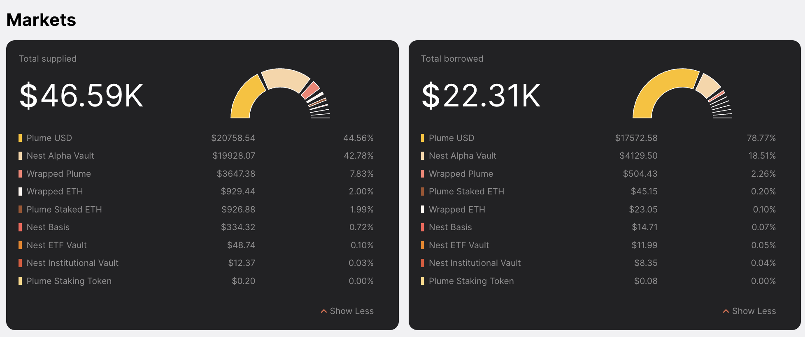
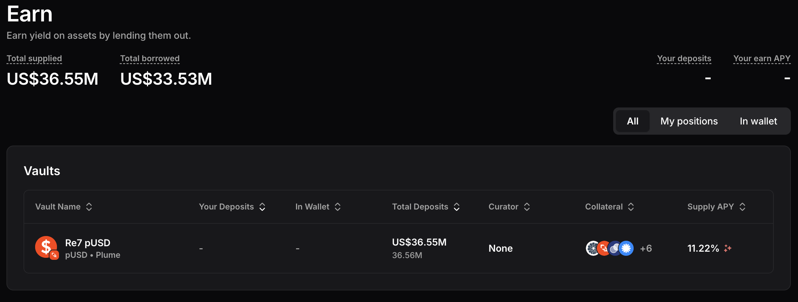
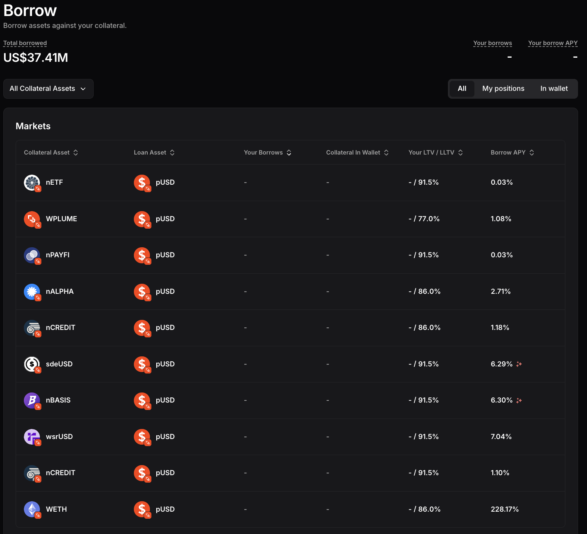

# Solera Risk Assessment Report

## Contents

1. TL;DR
2. Introduction
3. Research Methodology
4. Research References
5. Project Overview
6. Due Diligence
7. Code Overview
8. Audits & Security
9. Governance & Access Control
10. On-chain Analysis
11. Risk Estimation
12. Risk Assessment Summary
13. Monitoring

## 1. TL;DR

Solera Markets on Plume Network is **not a suitable venue for meaningful capital deployment at this stage**. The protocol is operational but highly centralized, critically dependent on bridge infrastructure, and shows negligible organic adoption in ETH markets (WETH/pETH).  

**Recommendation:**  

- Do **not** allocate material liquidity to Solera.  
- If Cicada wishes to experiment, limit exposure to **≤1–2% of the crypto portfolio** and treat it as a high-risk pilot.  
- Reassess only if Solera demonstrates sustained liquidity growth, proven liquidation performance, and decentralization of governance.  

## 2. Introduction

This report provides a structured assessment of the risks associated with supplying liquidity to the **Solera Markets** protocol.  
The scope of the analysis covers:

- **Technical risks** — vulnerabilities in smart contract code (reentrancy, access control bypass, integer issues), unsafe upgradeability patterns, reliance on external libraries, oracles, and proxies.  

- **Integration risks** — exposure to failures in external oracles, bridges, liquid staking tokens, or other third-party protocols that Solera relies on.  

- **Economic risks** — risks from protocol design such as collateral volatility, flawed liquidation mechanics, rate model instabilities, liquidity fragmentation, or correlated liquidations.  

- **Governance and centralization risks** — risks from concentrated privileges, reliance on a few EOAs or multisigs, lack of transparent governance, or misaligned incentives between protocol operators and users.  

- **Operational risks** — risks linked to key management, infrastructure downtime, RPC failures, or bugs in deployment/monitoring pipelines that may disrupt normal functioning.  

- **Regulatory and compliance risks** — uncertainty around legal status of assets (pETH, WETH), custodial implications of multisigs, or jurisdictional restrictions that could impact solvency or continuity.  

- **Market adoption and liquidity risks** — insufficient user adoption or fragmented liquidity leading to thin markets, high slippage, or systemic insolvency during stress events.  

- **Composability risks** — risks arising from other protocols integrating Solera markets or Solera integrating external DeFi components, creating hidden interdependencies that can amplify failures.   

The goal of this report is to determine whether providing WETH or pETH on Plume as collateral in Solera is advisable.  
Risks are categorized by severity and likelihood, and a final recommendation is given on whether Cicada should enter a position.  

**Limitations**: this is a point-in-time assessment based on publicly available information, code repositories, and on-chain data at the moment of research. Future changes in contracts, governance, or market conditions may affect the conclusions.

## 3. Research Methodology

### 3.1. Analytical Approach

Our approach is structured in clear stages, with each stage producing concrete evidence or findings.  
All conclusions are backed by documentation, code references, or on-chain data.

**Stage 0 — Scope**  
Define the exact scenario: supplying WETH or pETH on Plume, ideally in an isolated market.  

**Stage 1 — Due Diligence**  
Check legitimacy: official docs, audits, addresses, team/funding signals, and market presence.  

**Stage 2 — Protocol Review**  
Understand Solera’s market design, liquidation mechanics, oracle dependencies, and governance model.  

**Stage 3 — Smart Contracts**  
Review key contracts: deposits, borrowing, liquidations. Focus on upgradeability, access control, and admin powers.  

**Stage 4 — On-Chain Validation**  
Verify that documentation matches deployments. Confirm addresses, parameters, and current balances.  

**Stage 5 — External Data Cross-Check**  
Compare Solera’s reported metrics with independent sources (DefiLlama, Nansen, explorers).  

**Stage 6 — Risk Assessment**  
Classify risks into Smart-Contract, Integration, Economic, and Centralization. Score by severity × likelihood, and decide:

- Enter
- Enter with conditions
- Do not enter

**Stage 7 — Monitoring**  
Define what to track if we enter: contract changes, role shifts, pool balances, oracle freshness. Outline runbooks for emergency response.

### 3.2. Tools Used

- **[GitHub](https://github.com/)**: repo & commit review  
- **[GitBook](https://www.gitbook.com/)**: documentation cross-check  
- **[Slither](https://github.com/crytic/slither)**: static analysis  
- **[Foundry](https://book.getfoundry.sh/)**: unit tests, fuzzing, invariants, coverage  
- **[Hardhat](https://hardhat.org/)**: coverage (solidity-coverage), integration scripts  
- **[Tenderly](https://tenderly.co/)**: tx simulations  
- **[Explorer](https://explorer.plume.org/)**: address & role validation  
- **[DefiLlama](https://defillama.com/)**: TVL & liquidity metrics  
- **[Nansen](https://www.nansen.ai/)** / **[Dune](https://dune.com/)**: flows & activity

## 4. Research References

### 4.1. Official & Documentation

- [Website](https://solera.market)
- [Application](https://app.solera.market/)
- [Morpho dApp](https://morpho.solera.market/)
- [Documentation](https://docs.solera.market/)
- [Solera Labs Twitter](https://x.com/SoleraLabs)
- [Solera Markets Twitter](https://x.com/SoleraMarkets)
- [GitHub Organization](https://github.com/soleramarkets)
- [Discord Community](https://discord.com/invite/jAdmVMEhJr)
- [Medium Blog](https://medium.com/@SoleraMarkets)

### 4.2. Security audits

- [Zenith Audit Report (Dec 2024)](https://2550339912-files.gitbook.io/~/files/v0/b/gitbook-x-prod.appspot.com/o/spaces%2FxnKyOKJHYcrZeGHpRuHg%2Fuploads%2FLPus8JS8WGA5412Nf2eH%2FSolera%20-%20Zenith%20Audit%20Report%20-%2012-18-2024.pdf?alt=media&token=ade0f7c6-2105-422f-8411-f099cf71e00f)
- [Zellic Audit Report (Feb 2025)](https://2550339912-files.gitbook.io/~/files/v0/b/gitbook-x-prod.appspot.com/o/spaces%2FxnKyOKJHYcrZeGHpRuHg%2Fuploads%2FtSEQnq1GRItGbgiUcoFm%2FSolera%20-%20Zellic%20Audit%20Report%20-%2002-04-2025.pdf?alt=media&token=f5b48e43-6c77-4591-ac94-3a0754c54ca9)
- [Zellic Audit Report (March 2025)](https://2550339912-files.gitbook.io/~/files/v0/b/gitbook-x-prod.appspot.com/o/spaces%2FxnKyOKJHYcrZeGHpRuHg%2Fuploads%2F4UT7XaqETfzun5TSBrKU%2FSolera%20-%20Zellic%20Audit%20Report%20-%2005-19-2025.pdf?alt=media&token=065cf5fc-0f75-4e83-b061-c12e251c8c79)

### 4.3. Explorers & Analytics

- [DefiLlama: Solera](https://defillama.com/protocol/solera)
- [Dune: Solera](https://dune.com/whale_hunter/solera)
- [Dune: Plume Network](https://dune.com/kosyokmin/plume-network)

### 4.4. Media & Community

- [Medium: "Introducing Solera"](https://medium.com/@SoleraMarkets/introducing-solera-a6c857213569)
- [Medium: "Solera’s Complete RWAfi Solution built on Plume’s Infrastructure"](https://medium.com/@SoleraMarkets/soleras-comple-rwafi-solution-built-on-plume-s-infrastructure-0491cdea520e)

## 5. Project Overview

### 5.1. High-level Description

**Solera Markets** is a decentralized lending protocol deployed on **Plume Network**, an EVM-compatible blockchain designed to host tokenized real-world assets (RWA). Plume positions itself as a specialized Layer-1 for compliant RWA infrastructure, offering native integrations for tokenized treasuries, stablecoins, and other off-chain collateral. While this creates opportunities for institutional DeFi, it also introduces **network-level risks**, as Plume is a relatively new chain with limited validator decentralization compared to Ethereum mainnet or established L2s.  

Solera is a **fork of Aave v3** with an extended market design:  

- **Main Market:** a shared pool of liquidity where multiple assets can be supplied and borrowed against each other, similar to Aave’s pooled architecture.  
- **Isolated Markets:** powered by the Morpho stack, each market is a single collateral–single borrow pair. Risks are fully confined to that pair, and once deployed, an isolated market is immutable.  

When users supply assets, they receive **sTokens** — interest-bearing ERC-20 receipts that grow automatically as interest accrues (rebase-style). When borrowing, the protocol mints **vTokens** to represent variable debt; their balances increase as interest accrues, but unlike sTokens, they are non-transferable.  

Currently, Solera supports WETH and pETH on Plume, as well as stablecoins and other collateral types. Investors can either act as liquidity suppliers (earning yield via sTokens) or borrowers (taking on vToken debt). Returns are determined by dynamic interest rates set by market utilization.  

### 5.2. Key Features

1. **Dual market architecture:** Main pooled market (Aave fork) + isolated markets (Morpho stack).  

2. **Oracle diversification:** Multiple providers (Stork, eOracle, Chronicle) to reduce single-point-of-failure risk.  

3. **Risk parameters:** Asset-level LTV, liquidation thresholds, borrow/supply caps, and eMode for correlated assets.  

4. **Immutable isolated markets:** Once deployed, an isolated market cannot be modified, limiting governance risk.

5. **sTokens / vTokens model:** sTokens rebase to reflect supplier yield; vTokens track borrower debt.

6. **Governance & security:** Admin actions and upgrades controlled by a multisig setup, reducing centralization risk.

7. **Permissioned vs permissionless pools:** Optional access-controlled markets for institutional participants.

8. **Liquidity fragmentation trade-off:** Isolated markets localize risk but may reduce available liquidity for liquidations.

9. **Core collateral integration**: WETH and pETH (note: pETH is a bridged asset, introducing bridge risk tied to Ethereum ↔ Plume).

### 5.3. Supported Assets / Markets

#### 5.3.1. Market types

- **Main Market (Aave v3 fork):** pooled, multi-asset lending/borrowing with eMode for correlated assets.
- **Isolated Markets (Morpho stack):** immutable 1:1 collateral–borrow pairs; risks are siloed per market.

#### 5.3.2. Main Market - Overview

The main market in Solera is a shared liquidity pool inherited from the Aave v3 model. While the market lists core assets like WETH and pETH, in practice it is dominated by Plume-native tokens such as pUSD and Nest vault assets, with ETH exposure remaining marginal.

Each asset has defined risk parameters in documentation — including Maximum Loan-to-Value (LTV), Liquidation Threshold, Liquidation Penalty, Borrow Cap, and Supply Cap. For example, WETH and pETH are specified with Max LTV = 70% and Liquidation Threshold = 72.5%, with higher thresholds (up to 90%) under eMode for ETH-correlated assets. However, as of September 2025 the live dashboard displays LTV = 0% for most assets, reflecting that many markets are currently frozen.

Solera offers one-click recursive borrowing (“looping”) on selected assets (e.g., pUSD, nALPHA, nINSTO), allowing positions up to 10x leverage. While this boosts nominal yields and TVL, it greatly amplifies liquidation risk, especially given the thin liquidity of underlying assets.

Architecturally, this structure is designed to provide deep pooled liquidity. In practice, as of September 2025, liquidity is negligible (~$46K TVL), so the market cannot yet be considered deep or robust.

**Live snapshot (September 2025):**

This distribution shows that the market is currently concentrated in Plume USD and Nest Alpha Vault, while ETH-related assets (WETH, pETH) represent only a small share of supplied and borrowed balances.

#### 5.3.3. Main Market – Keypoints

Reference: [Solera App – Main Market Dashboard](https://app.solera.market/markets/?marketName=proto_plume_v3) (September 2025).

1. **Total liquidity check.**  
   - Data: ~$46.6K supplied, ~$22.3K borrowed.  
   - Observation: this is extremely low TVL for an institutional-grade protocol. Even moderate deposits/withdrawals would distort utilization and APYs.  
   - Conclusion: liquidity is insufficient for meaningful institutional positions.  

2. **Asset concentration.**  
   - Data: Plume USD (pUSD) ≈ $20.8K supplied / $17.6K borrowed; Nest Alpha Vault (nALPHA) ≈ $19.9K supplied / $4.1K borrowed. Together >85% of market activity.  
   - Observation: ETH-linked assets (WETH, pETH) together account for <4% of supply and <$100 borrowed.  
   - Conclusion: the market is dominated by Plume-native tokens, while ETH assets remain marginal.  

3. **ETH markets untested.**  
   - Data: WETH supply ~$930 / borrow ~$23; pETH supply ~$927 / borrow ~$45.  
   - Observation: positions are negligible compared to stablecoin activity.  
   - Conclusion: liquidation and collateral mechanics for ETH are unproven under real stress.  

4. **Collateral parameters.**  
   - Data: LTV = 0% for most assets.  
   - Observation: these assets cannot currently be used as effective collateral.  
   - Conclusion: the main market functions more like a liquidity sandbox than a full-featured credit market.  

5. **Borrow rates.**  
   - Data: pUSD borrow APY ≈ 10.5%; nINSTO borrow APY ≈ 10.6%.  
   - Observation: such elevated yields are caused by thin liquidity and small utilization shocks.  
   - Conclusion: current rates are unstable and not representative of sustainable demand.  

6. **Asset freezes.**  
   - Data: several assets are flagged as “frozen/paused”. The wording (“by Aave community decisions”) is inherited from the Aave v3 fork. In Solera this reflects an internal governance/admin decision.
   - Observation: in practice, this disables new supply/borrow, leaving only withdrawals and repayments.  
   - Conclusion: reliance on governance/ops interventions highlights early-stage maturity and centralization of risk management.  

7. **Market composition.**  
   - Data: most activity in pUSD, nALPHA, and other Plume-native tokens.  
   - Observation: ETH-linked assets are marginal (<4% of balances).  
   - Conclusion: the main market is currently dominated by Plume-native tokens rather than widely recognized crypto assets.

**Overall conclusion:**  
The Main Market is shallow, highly concentrated in Plume-native assets, and not yet functional for ETH collateral. Governance-level freezes and 0% LTV parameters further limit usability. For institutional investors, this underlines both the early-stage nature of the protocol and its dependency on Plume-native infrastructure. Additionally, reliance on pETH introduces bridge risk tied to Plume ↔ Ethereum infrastructure.

#### 5.3.4. Isolated Markets – Overview

Solera’s isolated markets are implemented on the **Morpho stack**, where each market is a single collateral–borrow pair (e.g., nETF–pUSD, WETH–pUSD), where the loan asset is consistently pUSD. Once deployed, these markets are **immutable**, meaning parameters cannot be changed later. This design centralizes systemic exposure on the stability of Plume’s native stablecoin.

Deposits are funneled into **vaults**, which then allocate liquidity across a set of whitelisted isolated markets. For example, the **Re7 pUSD vault** aggregates deposits and routes them into pUSD-denominated markets. Users receive yield-bearing positions from the vault, while the vault enforces loan-to-value ratios (LLTV) and oracle configurations.

The key benefit is **risk containment**: failures in one market cannot propagate across the protocol. The trade-off is **liquidity fragmentation** and dependency on vault operators, since each vault defines which markets are supported and how funds are distributed.

#### 5.3.5. Isolated Markets – Keypoints

Reference: [Solera Morpho App](https://morpho.solera.market) (September 2025).

1. **Liquidity snapshot.**  
   - Data: ~$36.55M supplied, ~$33.52M borrowed.  
   - Observation: liquidity in isolated markets is ~800x higher than in the main market (~$46K TVL).  
   - Conclusion: the effective protocol activity is concentrated in Morpho-based isolated markets, while the main market is effectively dormant.  

2. **Vault concentration.**  
   - Data: all deposits concentrated in a single **Re7 pUSD vault** (≈$36.5M).  
   - Observation: this creates a single point of failure; vault misconfiguration or curator failure could impact the entire isolated markets segment.  
   - Conclusion: diversification across multiple vaults is absent; systemic exposure is concentrated.  

3. **Systemic dependency on pUSD.**  
   - Data: all loans are denominated in **pUSD**; collateral assets include nETF, wPLUME, nALPHA, nCREDIT, WETH, nTBILL, and others.  
   - Observation: since pUSD is the sole loan currency, the entire isolated markets segment is fully exposed to its stability.  
   - Conclusion: any depeg, oracle failure, or contract issue with pUSD would directly impact all isolated markets simultaneously, creating a systemic single point of failure.  

4. **Very high LLTV parameters.**  
   - Data: many markets operate with **LLTV = 86–91.5%** (vs 70–80% typical in Aave).  
   - Observation: safety margins are thin; even minor price moves or oracle glitches could trigger liquidations.  
   - Conclusion: elevated liquidation risk relative to established lending protocols.  

5. **Borrow APY dispersion.**  
   - Data:  
     - Low APY (≈0–1%) for collateral like nETF, wPLUME.  
     - Moderate APY (≈6–7%) for some stable derivatives (sdeUSD, nBASIS, wsrUSD).  
     - **Extreme APY spikes in thin markets**: WETH ≈ 227%, nALPHA ≈ 154%.  
   - Observation: these outliers are not sustainable yields, but artifacts of **very low liquidity**, where a handful of loans drive utilization sharply upward.  
   - Conclusion: borrowing costs are highly volatile and unpredictable. Such behavior highlights that some isolated markets are effectively non-functional for institutional flows.

6. **Governance/curation risk.**  
   - Data: Re7 vault displays “No curator” in the UI. It is unclear whether this reflects true centralization or incomplete UI data. At minimum, curator governance is opaque, introducing uncertainty for depositors.
   - Observation: participants cannot choose allocation; vaults decide which isolated markets to support.  
   - Conclusion: introduces governance risk and dependency on vault operators.  

**Overall conclusion:**  
While Solera’s isolated markets show significantly higher TVL than the main market, they are fragile: liquidity is hyper-concentrated in a single vault, safety margins are stretched with 86–91.5% LLTV, borrowing rates are highly uneven, and systemic dependency on pUSD is absolute. For institutional participants, this design amplifies both **counterparty risk (vault curator)** and **systemic risk (Plume stablecoin + bridge).**

## 6. Due Diligence

The Solera project presents itself as a credit hub on Plume, but the broader due diligence raises several concerns about maturity and long-term viability.  

**Team.** The developers behind Solera remain fully anonymous. No names, LinkedIn profiles, or GitHub activity are disclosed. While anonymity is not unusual in DeFi, it reduces accountability and makes it difficult to assess the competence of the team compared to protocols like Aave or Morpho where track record is public.  

**Funding and investors.** There is no evidence of venture backing or institutional investors. The only visible affiliation is with the Plume ecosystem itself, as Solera is exclusively deployed on Plume and relies on Morpho’s stack. This creates some ecosystem credibility but also ties Solera’s success entirely to the fate of a single emerging L1.  

**Documentation.** The project maintains relatively structured docs with risk parameters, addresses, and audit links. However, discrepancies exist between the documentation and live deployment: for instance, WETH/pETH are described with LTV values around 70%, yet the dashboard currently shows LTV = 0% due to frozen assets. Such gaps suggest that live configuration lags behind specifications, a sign of operational immaturity.  

**Listings and market metrics.** Solera is listed on DefiLlama but absent from other major aggregators like CoinGecko, CMC, or Token Terminal. According to DefiLlama (Sep 2025), TVL is ~$24.5K with ~$22.3K borrowed. Earlier in June, TVL briefly spiked above $16M before collapsing back near zero, indicating either testing by a single large depositor or temporary inflation through incentives. Such volatility undermines confidence in the stability of the user base.  

**Social presence.** The project maintains a website and a Twitter/X account, but community engagement is weak and no active Discord/Telegram hubs were found. The limited visibility makes it unlikely that Solera can attract sustained user adoption without stronger outreach.  

Overall, the due diligence paints Solera as an **early-stage, high-risk protocol**: the team is anonymous, there is no clear investor backing, documentation and live configuration diverge, and traction remains limited. Its close link to the Plume ecosystem gives some credibility, but also concentrates systemic risk on a single chain and its native stablecoin (pUSD).

## 7. Code Overview

This section provides a deployment-grounded overview of Solera’s smart contracts on **Plume**, grouped by function.  
All addresses were validated via AddressBook, Tenderly, and Foundry fork tests against `PLUME_RPC`.

**Red flag**: The core codebase of Solera is **not public**.

This significantly limits transparency, prevents community review, and reduces the ability for independent researchers to verify implementation details. All analysis below is therefore based on **on-chain verified contracts**, Tenderly traces, and Foundry fork testing.

### 7.1 Component map (by cluster)

#### A) Governance & Control

| Contract       | Address |
|----------------|---------|
| **ACLManager** | `0x267781db3b81947216F74d3ee4CefF0D7156Dcfa` |
| **ProxyAdmin (Gnosis Safe)** | `0xA31165684aFA01bBA6D3270c1d182919ACf539f2` |

**Observations**  
- `ACLManager` exposes roles: `POOL_ADMIN_ROLE`, `RISK_ADMIN_ROLE`, `EMERGENCY_ADMIN_ROLE`, `ASSET_LISTING_ADMIN_ROLE`, `BRIDGE_ROLE`, `FLASH_BORROWER_ROLE`.
- `PoolAddressesProvider.owner()` and `getACLAdmin()` both resolve to `0x4e16eF0278E89f4A79f3581aB0afDF467b1754cD`.  
- Role membership was not fully enumerated; Tenderly showed only role IDs.  

#### B) Core Routing & Configuration

| Contract                    | Address |
|-----------------------------|---------|
| **PoolAddressesProvider**   | `0x6C0133c25BAeF3D4188C26BbA3f0aC5e85FFa815` |
| **PoolProxy**               | `0x2a8D6a5faB9190580006187b6693f4F69Ee2b07d` |
| **PoolConfiguratorProxy**   | `0xbAA677f70516432C0301039975E46a6B904d1977` |
| **ProtocolDataProvider**    | `0xEE343bd811500ca27995Bc83D7ec2bacb63680d0` |

**Observations**  
- Anchors from `PoolAddressesProvider` matched these addresses.
- `PoolProxy.admin` and `PoolConfiguratorProxy.admin` both returned `0x000…000`.  
  - This is consistent with **UUPS-style proxies** where upgrade rights are handled in the implementation, not via admin slot.  
- `ProtocolDataProvider` returned coherent reserve/token mappings.  

#### C) Markets & Tokens

**WETH market**

| Token | Address |
|-------|---------|
| **Underlying WETH** | `0xca59cA09E5602fAe8B629DeE83FfA819741f14be` |
| **sToken** | `0x3a616E5e559593d26adfB7F520b2bb3fB512f90D` |
| **vToken** | `0x442E289205e925dA232f91ed447427Ed1c71a743` |

**pETH market**

| Token | Address |
|-------|---------|
| **Underlying pETH** | `0x39d1F90eF89C52dDA276194E9a832b484ee45574` |
| **sToken** | `0x30Bb4B93925A6B714f8d0232C69c302541681f35` |
| **vToken** | `0x4fC4dE25377b671fA38D855b4cEF72Ae7f74F43a` |

**Observations**  
- Reserve snapshots returned consistent values (`getReserveData`, `getReserveNormalizedIncome`, `getReserveNormalizedVariableDebt`).

#### D) Oracle & Pricing

| Contract       | Address |
|----------------|---------|
| **AaveOracle** | `0x4E269bba0501a4eaa0A008858513faf6b0F6375` |

**Observations**  
- `OracleSnapshot` tests produced valid non-zero prices: ~4.29e11 (WETH), ~4.33e11 (pETH).

#### E) Rewards & Emissions

| Contract | Address |
|----------|---------|
| **RewardsControllerProxy** | `0xf76F8fE7e3539228fE298549C5C4D959094585E1` |
| **RewardsControllerImplementation** | `0x2D2fe2D75a49Cb027cf933734134Ce4bbBD9b99c` |
| **EmissionManager** | `0x9bd5ac51cffff3aefad5c349a25b8cde1576307e` |

**Observations**  
- Rewards controller is proxied; implementation active.
- Emission parameters were not captured in this phase.

#### F) Treasury

| Contract | Address |
|----------|---------|
| **TreasuryProxy** | `0x7dbD4D91efc83Ed1BF5549c1114Decb5Dd010907` |
| **TreasuryImplementation** | `0x64C2f8071830CB0d0C09d20Ca9Dab4178795b0f3` |

**Observations**  
- `TreasuryProxy.admin` is the **Gnosis Safe** `0xA31165684aFA01bBA6D3270c1d182919ACf539f2`.
- Contrasts with Pool/Configurator proxies (admin slot = zero).  

### 7.2 Interaction sketch

- **User actions** (deposit, withdraw, borrow, repay) → `PoolProxy` implementation.  
  - Reads **oracle** prices.  
  - Mints/burns **sTokens** and **vTokens**.  
  - Feeds data to **ProtocolDataProvider** and **RewardsController**.  
- **Admin actions** (list asset, adjust caps) → `PoolConfiguratorProxy`, gated by **ACLManager**.  
- **Rewards** → emission logic from **EmissionManager**, distributed by **RewardsControllerProxy**.  
- **Treasury** → fees accumulate in **TreasuryProxy/Impl**, controlled by **Gnosis Safe**.

### 7.3 Validated via tests

- Anchors from AP matched expected addresses.
- Pool/Configurator proxies returned `admin = 0x0`.
- Treasury proxy admin = **Gnosis Safe**.  
- Oracle returned valid WETH/pETH prices.  
- Reserve snapshots showed coherent reserve states.  
- ACL alignment confirmed: AP.owner = AP.getACLAdmin = `0x4e16eF0278E89f4A79f3581aB0afDF467b1754cD`.  

### 7.4 Gaps

- Proxy upgrade authority for Pool/Configurator not confirmed (likely UUPS).  
- Role membership (beyond admin alignment) not enumerated.  
- Risk parameters (LTVs, LT, supply/borrow caps) not captured in this section.  
- Reward schedules not extracted.  

### 7.5 Address roll-up

- **AP** — `0x6C0133c25BAeF3D4188C26BbA3f0aC5e85FFa815`  
- **PoolProxy** — `0x2a8D6a5faB9190580006187b6693f4F69Ee2b07d`  
- **PoolConfiguratorProxy** — `0xbAA677f70516432C0301039975E46a6B904d1977`  
- **ACLManager** — `0x267781db3b81947216F74d3ee4CefF0D7156Dcfa`  
- **AaveOracle** — `0x4E269bba0501a4eaa0A008858513faf6b0F6375`  
- **ProtocolDataProvider** — `0xEE343bd811500ca27995Bc83D7ec2bacb63680d0`  
- **RewardsControllerProxy** — `0xf76F8fE7e3539228fE298549C5C4D959094585E1`  
- **RewardsControllerImpl** — `0x2D2fe2D75a49Cb027cf933734134Ce4bbBD9b99c`  
- **EmissionManager** — `0x9bd5ac51cffff3aefad5c349a25b8cde1576307e`  
- **TreasuryProxy** — `0x7dbD4D91efc83Ed1BF5549c1114Decb5Dd010907`  
- **TreasuryImpl** — `0x64C2f8071830CB0d0C09d20Ca9Dab4178795b0f3`  
- **ProxyAdmin (Gnosis Safe)** — `0xA31165684aFA01bBA6D3270c1d182919ACf539f2`  
- **WETH underlying/s/v** — `0xca59cA09E5602fAe8B629DeE83FfA819741f14be` / `0x3a616E5e559593d26adfB7F520b2bb3fB512f90D` / `0x442E289205e925dA232f91ed447427Ed1c71a743`  
- **pETH underlying/s/v** — `0x39d1F90eF89C52dDA276194E9a832b484ee45574` / `0x30Bb4B93925A6B714f8d0232C69c302541681f35` / `0x4fC4dE25377b671fA38D855b4cEF72Ae7f74F43a`  

## 8. Audits & Security

### 8.1 Existing audits

Solera has undergone three external reviews: a short assessment by Zenith (Dec 2024) of listing scripts and market operations, and two audits by Zellic (Feb and Mar 2025) covering the staking module and the looping extension. Reported severities vary, but overall scope was narrow and time-boxed. No audit of the full protocol has been published.

### 8.2 Core themes

Across the reports, one pattern is clear: the critical risks are not low-level coding errors but **the concentration of admin powers**.

- In the staking vault, auditors showed that fee and vesting admins could manipulate prices, set confiscatory fees, or drain funds outright.  
- In listing scripts, Zenith noted that markets could be deployed without safeguards, leaving users exposed.  
- In looping, the issues were formally “informational,” but auditors stressed weak testing and reliance on trusted operators.  

In some cases the labeling was inconsistent: findings marked *Critical* in detail were reported as *High* in summaries. Regardless of taxonomy, the substance is that **privileged roles remain capable of harming investors**.

### 8.3 Summary

The audit trail suggests that Solera’s main risk is not external exploitation but **internal abuse or mismanagement**.  
While individual issues have been patched, the underlying model leaves investors dependent on the goodwill of administrators. With no open-source code, limited testing, and opaque governance, Solera cannot be considered trust-minimized.  

For institutional allocators this amounts to a **high scam-risk profile**: funds are secure only insofar as Solera’s operators choose not to use their powers against users.

## 9. Governance & Access Control

The Solera protocol implements a governance structure centered around the `ACLManager` contract and a limited set of privileged addresses. Our analysis, based on on-chain inspection and Foundry tests, yields the following observations:

### Core Governance Addresses

- **Owner / ACL Admin (same EOA):**  
  `0x4e16eF0278E89f4A79f3581aB0afDF467b1754cD`
- **ACL Manager contract:**  
  `0x267781db3b81947216F74d3ee4CefF0D7156Dcfa`
- **Proxy Admin (Treasury / rewards governance):**  
  `0xA31165684aFA01bBA6D3270c1d182919ACf539f2` (Gnosis Safe multisig)

### Proxy Administration

- **Pool Proxy (`0x2a8D6a5faB9190580006187b6693f4F69Ee2b07d`)** → `admin = 0x0000000000000000000000000000000000000000`  
- **PoolConfigurator Proxy (`0xbAA677f70516432C0301039975E46a6B904d1977`)** → `admin = 0x0000000000000000000000000000000000000000`  
- **Treasury Proxy (`0x7dbD4D91efc83Ed1BF5549c1114Decb5Dd010907`)** → `admin = 0xA31165684aFA01bBA6D3270c1d182919ACf539f2`  

This indicates that upgradeability for **Pool** and **Configurator** has been fully renounced (admins set to zero), while the **Treasury** remains upgradeable under a Gnosis Safe.

### Roles in ACLManager

- **POOL_ADMIN** → `0x4e16eF0278E89f4A79f3581aB0afDF467b1754cD`  
- **EMERGENCY_ADMIN** → `0x4e16eF0278E89f4A79f3581aB0afDF467b1754cD`  
- **RISK_ADMIN** → Declared role, no active holders found  
- **ASSET_LISTING_ADMIN** → Declared role, no active holders found  
- **BRIDGE_ROLE** → Declared role, no active holders found  

### Sentinel

- **Price Oracle Sentinel:** `0x0000000000000000000000000000000000000000` (unset)

### Key Takeaways

- **Upgradeability:** Core lending contracts (Pool, Configurator) are locked and cannot be upgraded. Treasury and rewards contracts remain upgradeable via a Gnosis Safe.  
- **Centralization:** Effective governance power is concentrated in a single externally-owned account (`0x4e16eF0278E89f4A79f3581aB0afDF467b1754cD`) and one Gnosis Safe (`0xA31165684aFA01bBA6D3270c1d182919ACf539f2`).  
- **Unused roles:** `RISK_ADMIN`, `ASSET_LISTING_ADMIN`, and `BRIDGE_ROLE` exist in the ACLManager contract but are not assigned to any active addresses. This limits flexibility for protocol operations.  
- **Missing safety module:** The absence of a configured Price Oracle Sentinel increases exposure to oracle manipulation, as the protocol has no mechanism to halt operations in case of faulty or malicious price feeds.  
- **No DAO governance:** There is no evidence of a token-based or decentralized governance process. Governance is effectively centralized around a small set of privileged addresses.

## 10. On-chain Analysis

An analysis of Solera’s on-chain activity and public metrics (via DeFiLlama) reveals patterns that warrant caution:

- **TVL spike-and-drop anomaly**  
  In May–June 2025, Solera’s TVL abruptly surged to ~$15–18M and then collapsed back to near-zero levels.  
  Such behavior is inconsistent with organic growth and more typical of *artificial liquidity injections* (e.g., team or investor deposits for metric inflation) followed by full withdrawal.

- **Current TVL is negligible**  
  As of the time of assessment, Solera’s TVL stands at ~$25k, with ~$22k borrowed.  
  This indicates that almost the entire pool is utilized, leaving minimal liquidity buffer.  
  It also suggests that a single participant (or a very small set) may control most of the protocol’s funds.

- **Borrowed / TVL ratio ≈ 0.9**  
  Normally, lending protocols retain idle liquidity to absorb user withdrawals.  
  In Solera’s case, nearly all available capital is borrowed out, which may point to *self-supply/self-borrow activity* designed to simulate demand.

- **Potential wash borrowing**  
  The combination of sudden inflows/outflows and high utilization suggests the possibility of wash borrowing — where liquidity providers and borrowers are effectively the same entities, creating misleading on-chain metrics.

- **Systemic fragility**  
  With such a small capital base, even a modest withdrawal or liquidation event could render the system insolvent.  
  This makes the protocol highly vulnerable to liquidity cliffs.

---

### Risk Implications

- Reported metrics may **not reflect genuine external adoption**, but rather orchestrated activity.  
- The protocol currently operates with **minimal liquidity resilience**, amplifying the risk of insolvency.  
- Any exposure to Solera should be treated with heightened caution until organic, diversified liquidity growth can be verified.

## 11. Risk Estimation

This section consolidates **all material risks** into a single, decision-oriented view. It avoids restating prior evidence; instead it references earlier sections (e.g., §5 Markets, §7 Code, §8 Security, §9 Governance) and converts observations into scores, alerts, and actions.

### 11.1 Methodology

- **Likelihood (L)**: 1–5 (Rare → Near-certain)  
- **Impact (I)**: 1–5 (Negligible → Severe)  
- **Score (S)**: `S = L × I`  
- **Level**: Low (1–6), Medium (7–10), High (11–15), Critical (16–25)

Where applicable we define **leading indicators** and **escalation thresholds**.

### 11.2 Risk Register (top items)

| ID | Risk statement | Why it matters (ref.) | L | I | S | Level | Early-warning indicators (KPI → threshold) | Primary mitigations |
|---|---|---|---:|---:|---:|---|---|---|
| **R1** | **Systemic dependency on pUSD** across isolated markets (borrow leg concentration). | Single-asset dependency → peg/issuer/governance risk propagates system-wide (§5). | 4 | 5 | **20** | **Critical** | Borrow share in pUSD ≥ **80%** of isolated book; on/off-ramp depth ↓; peg deviation > **30 bps** 24h. | Diversify quote assets (USDC/DAI), introduce caps per asset/market, automated depeg circuit. |
| **R2** | **High LLTV (86–91.5%)** with thin buffers. | Small price moves/oracle noise can cascade liquidations (§5). | 4 | 5 | **20** | **Critical** | Share of markets with LLTV ≥ **90%**; liquidation failure rate > **2%** events; close-factor usage spikes. | Reduce LLTV, raise liquidation bonus, dynamic caps, stress tests on volatile feeds. |
| **R3** | **Liquidity fragility & usage concentration.** | Main market has “dust” depth for ETH; isolated liquidity concentrated in a single vault (§5). | 4 | 5 | **20** | **Critical** | Top-1 vault ≥ **70%** of supplied notional; utilization swings > **25pp** intraday; AMM depth < **$1m** near peg. | Multi-vault diversification, per-market borrow caps, incentive rebalancing, market-making SLAs. |
| **R4** | **Oracle circuit-breaker absent** (sentinel not configured). | Mispricing can propagate without a stop-loss (§9). | 3 | 5 | **15** | **High** | Sentinel address = null; price deviation vs reference > **1%/block** without halt; feed stale > **N blocks**. | Enable sentinel with deviation/staleness rules; dual-source aggregation and failover. |
| **R5** | **Bridge dependency (pETH)** for ETH exposure. | Bridge liveness/security is an external trust assumption (§5). | 3 | 5 | **15** | **High** | Bridge paused; proof delays > **X min** P95; security advisories; withdrawal backlog. | Add native ETH or alternate wrapped ETH; bridge risk caps; pause logic tied to bridge status. |
| **R6** | **Closed-source & upgradeable core.** | Low auditability; changes can introduce regressions (§7–§8). | 3 | 4 | **12** | **High** | Proxy implementation changes without public RFC; missing release notes/tests; audit diff gaps. | Publish repo/tests; timelock upgrades; third-party diff audits; canary markets. |
| **R7** | **Governance opacity & key-holder concentration.** | Few actors hold broad privileges; no formalized process (§9). | 3 | 4 | **12** | **High** | Privileged calls (pause/param change) with no prior notice; signer set changes; absent onchain proposals. | Document roles/runbooks; bigger multisig quorum & delay; emergency council scope-limited. |
| **R8** | **Market-integrity anomalies (wash-trading suspicion).** | Volume spikes vs tiny TVL undermine signal quality (§10). | 3 | 4 | **12** | **High** | Vol/TVL ratio > **5×** without net state change; repeated self-matching patterns. | Outlier filters in reporting; exclude incentive-only flows; independent usage telemetry. |
| **R9** | **Platform/infra immaturity (Plume).** | Tooling for liquidations/monitoring still maturing (§5). | 3 | 4 | **12** | **High** | Liquidation latency P95 > **N sec**; RPC error rate > **X%**; missed keeper runs. | Multi-RPC failover; offchain keepers; dry-run drills; SLA with node providers. |
| **R10** | **Doc vs live config drift.** | Discrepancies in LTV/freeze state lead to wrong operator assumptions (§5). | 2 | 4 | **8** | **Medium** | Diff between docs and on-chain params; unannounced freezes. | Doc automation from on-chain; change-logs; config review gates. |
| **R11** | **Regulatory/counterparty risk around pUSD.** | Policy/governance shifts can affect access/liquidity (§5). | 2 | 4 | **8** | **Medium** | Issuer policy updates; custody/blacklist events; off-ramp frictions. | Counterparty DD; exposure caps; alternatives ready. |

### 11.3 Heatmap (overview)

|            | **Impact: 1** | **2** | **3** | **4** | **5** |
|------------|:-------------:|:-----:|:-----:|:-----:|:-----:|
| **L: 5**   |               |       |       |       | **R1,R2,R3** |
| **4**      |               |       |       | **R6,R7,R8,R9** | **R4,R5** |
| **3**      |               |       |       | **R10,R11** |  |
| **2–1**    | (lower-tier items not listed) |

### 11.4 Decision rules (portfolio fit)

- **Entry gate (all required):** oracle sentinel live & tested; LLTV ≤ **80%** for new listings; borrow-side diversification (pUSD share < **60%**) or documented pUSD backing; public code & release notes for last upgrade; demonstrated liquidations under volatility.
- **Position sizing:** until gates met → **0–1%** of crypto sleeve (R&D). After gates met and stability over **≥90 days** → **1–2%** with hard caps per asset/market.
- **Scale-down triggers:** breach of sentinel uptime; bridge pause > **X hours**; pUSD peg deviation > **50 bps** 24h; liquidation failure spikes; governance changes without delay/audit.

### 11.5 Monitoring (operational checklist)

- **Oracle & pricing:** sentinel status; deviation/staleness counters; cross-source divergence.  
- **Liquidity & usage:** TVL/utilization, borrow caps, concentration by vault/asset, liquidation latency & success rate.  
- **Governance & upgrades:** proxy implementation diffs; privileged calls; signer/quorum changes; documented proposals.  
- **Bridge health:** pause states, proof latencies, backlog; incident advisories.  
- **Market integrity:** Vol/TVL outliers, self-trade motifs, net-state deltas vs reported volume.  
- **Documentation hygiene:** automated diff between on-chain params and docs/UI.

### 11.6 Bottom line

The binding constraints today are: **pUSD concentration (R1), high LLTV with thin buffers (R2), liquidity fragility (R3)**, and **missing oracle circuit-breaker (R4)**. Until these are addressed and real-world stress behavior is observed, any exposure should be treated as **experimental**, gated by §11.4 and monitored per §11.5.

## 12. Risk Assessment Summary

This section synthesizes all identified risks (§11) into a concise, decision-oriented view for Cicada Capital.

### Key Findings

- **Systemic fragility:** Solera’s isolated markets rely entirely on pUSD as the borrow leg. This introduces both bridge and stablecoin dependency, magnifying systemic risk.  
- **Aggressive risk parameters:** High LLTV (86–91.5%) leaves extremely thin buffers against volatility, unlike mature protocols (Aave, Compound).  
- **Liquidity immaturity:** Main market ETH positions are negligible, and isolated market liquidity is concentrated in a single vault. This creates fragility and exposes participants to vault-level governance risk.  
- **Missing safeguards:** The price oracle sentinel is not configured, leaving no mechanism to halt mispriced operations.  
- **Governance opacity:** Privileged roles are concentrated in one EOA and a Gnosis Safe multisig. There is no DAO process, token governance, or transparent upgrade path.  
- **Adoption risk:** TVL volatility and suspicious on-chain flows raise concerns of wash trading or artificially inflated metrics.

### Overall Risk Profile

- **Severity:** High to Critical across systemic, economic, and governance dimensions.  
- **Likelihood:** Medium to High, given Plume’s immaturity and Solera’s operational opacity.  
- **Residual risk:** Even if audits patch coding bugs, the underlying architecture leaves investors exposed to single points of failure.

### Recommendation

- **Do not allocate meaningful capital at current stage.**  
- Any exposure should be treated as **experimental (≤1% of crypto sleeve)** under strict monitoring.  
- Re-entry conditions:  
  - pUSD dependency reduced (<60% borrow share).  
  - LLTV lowered to ≤80% with documented stress-test results.  
  - Oracle sentinel enabled and tested.  
  - Governance widened (≥3/5 multisig, public process).  
  - Sustained organic liquidity growth with ≥$50m TVL and diversified vaults.

**Bottom line:**  
Solera today is not investment-grade. The combination of systemic dependency, fragile parameters, missing safeguards, and governance opacity makes it unsuitable for institutional-scale positions. Cicada should monitor developments but defer significant entry until risk mitigations are in place.

## 13. Monitoring

To mitigate residual risks, Cicada should implement continuous monitoring of Solera’s on-chain activity. The following signals should be tracked in real-time with alerting thresholds:

### Governance and Admin

- **Role changes in ACLManager**  
  Monitor `RoleGranted` / `RoleRevoked` events for POOL_ADMIN, RISK_ADMIN, EMERGENCY_ADMIN, BRIDGE_ROLE.  
  Any new EOA gaining privileges should trigger an alert.  
- **Proxy upgrades**  
  Track `upgradeTo` events on `poolProxy`, `poolConfiguratorProxy`, and `treasuryProxy`.  
  Immediate review required for any new implementation address.  
- **Timelock or Safe activity**  
  Monitor multisig (0xA31165684aFA01bBA6D3270c1d182919ACf539f2) for queued or executed transactions.

### Market Parameters

- **Reserve configuration changes**  
  Detect calls to `configureReserveAsCollateral`, `setReserveFactor`, or LLTV changes.  
  Alerts if LLTV > 80% or ReserveFactor < 10%.  
- **Oracle changes**  
  Track `setAssetSources` in AaveOracle.  
  Alert if oracle source changes to an unverified contract.

### Liquidity and Flow

- **Supply and borrow volumes**  
  Monitor WETH/pETH supply and borrow. Alert if utilization > 90% or if supply/borrow deviates >30% in <24h.  
- **sToken/vToken anomalies**  
  Detect sudden mint/burn spikes that exceed 10% of circulating supply.  
- **Treasury balance shifts**  
  Track transfers from Treasury proxy (0x7dbD4D91efc83Ed1BF5549c1114Decb5Dd010907).  
  Alert if outflows > $50k equivalent in 24h.

### Bridge and Cross-Chain

- **pETH supply vs. bridge inflows**  
  Compare minted pETH against deposits on the Plume ↔ Ethereum bridge. Alert on discrepancies >1%.  
- **Bridge contract events**  
  Monitor `Deposit`, `Withdraw`, `Paused` events for anomalies.

**Implementation:**  

- Use Tenderly alerts, Forta agents, or custom Foundry scripts with `cast logs` pipelines.  
- Alerts routed to Telegram/Slack for real-time response.  
- Weekly reporting on governance activity, parameter shifts, and liquidity trends.
