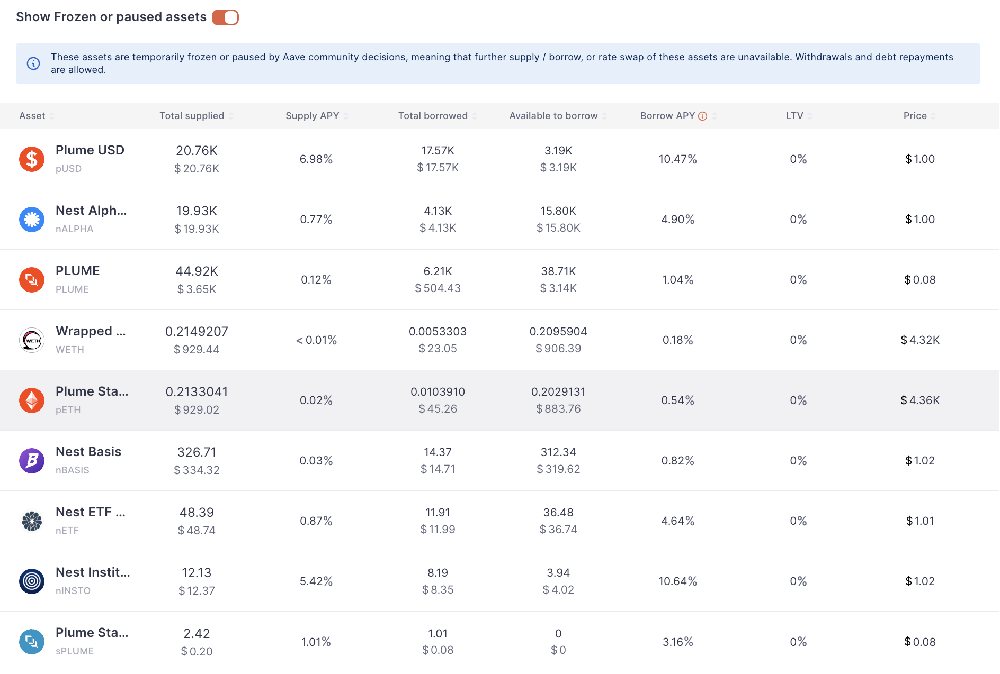

# Solera Risk Assessment Report

## Contents

1. TL;DR
2. Introduction
3. Research Methodology
4. Research References
5. Project Overview
6. Due Diligence
7. Code Overview
8. Audits & Security
9. Governance & Access Control
10. On-chain Analysis
11. Risk Estimation
12. Risk Assessment Summary
13. Monitoring

## 1. TL;DR

Solera Markets on Plume Network is **not suitable for material capital allocation at this stage**.  
The protocol is live but remains highly centralized, **dependent on the Plume ↔ Ethereum bridge (pETH)**, and shows **very limited adoption in ETH markets (WETH/pETH)**.  

**Recommendation:**  

- Do **not** allocate significant liquidity to Solera at this point.  
- If Cicada wishes to experiment, limit exposure to **≤1–2% of the crypto portfolio**, treating it as a **systemic and operational high-risk pilot**.  
- Reassess only if Solera demonstrates sustained liquidity growth, proven liquidation performance, and decentralized governance practices.  

## 2. Introduction

This report provides a structured risk assessment of supplying liquidity to the **Solera Markets** protocol on Plume Network.  
The analysis considers multiple categories of risk relevant to Solera’s current stage of development:

- **Technical risks** — vulnerabilities in smart contracts, upgradeability design, proxy architecture, and dependence on external libraries/oracles.  
- **Integration risks** — reliance on the Plume ↔ Ethereum bridge (pETH), external oracles, and liquid staking assets that introduce systemic dependencies.  
- **Economic risks** — thin liquidity in ETH markets, untested liquidation mechanisms, and potential instability of rate models under stress.  
- **Governance and centralization risks** — concentrated control in a small set of EOAs and multisigs, lack of decentralized governance processes, and unclear accountability.  
- **Operational risks** — key management, multisig operations, RPC stability, and infrastructure maturity of the Plume ecosystem.  
- **Regulatory and compliance risks** — unclear legal treatment of bridged assets (pETH), multisig custodianship, and jurisdictional exposure.  
- **Market adoption and liquidity risks** — currently negligible ETH market size, raising concerns about market depth, slippage, and systemic solvency.  
- **Composability risks** — possible contagion effects if Solera is integrated by other DeFi protocols, or if it relies on external dependencies without clear isolation.  

The goal is to determine whether providing WETH or pETH on Plume as collateral in Solera is advisable.  
Risks are assessed by severity and likelihood, with a final recommendation for Cicada’s investment decision.  

**Limitations**: This is a point-in-time analysis based on available on-chain data and test snapshots. The codebase is not publicly accessible, which limits transparency. Future changes in contracts, governance, or market conditions may materially affect conclusions.  

## 3. Research Methodology

### 3.1. Analytical Approach

Our approach was structured in stages, with each producing concrete evidence.  
Where direct code access was not possible (non-public repositories), we relied on on-chain data and proxy inspection.

**Stage 0 — Scope Definition**  
Clarify the exact scenario under review: supplying WETH or pETH on Plume Network as collateral in Solera Markets.  

**Stage 1 — Due Diligence**  
Assess legitimacy: official documentation, contract deployments, audit references, ecosystem support, and investor/team background.  

**Stage 2 — Protocol Review**  
Analyze Solera’s market structure, liquidation mechanics, oracle dependencies, and access control model.  

**Stage 3 — Smart Contracts**  
Inspect deployed contracts via proxies and AddressBook references. Focus on upgradeability, admin roles, and privileged functions.  
Note: the source code is not publicly available, which limits the depth of this review.  

**Stage 4 — On-Chain Validation**  
Cross-check documentation with deployed state: verify addresses, mappings, balances, and key protocol parameters.  

**Stage 5 — External Data Correlation**  
Compare Solera’s on-chain metrics with third-party dashboards (DefiLlama, Nansen, Dune, Plume explorer).  

**Stage 6 — Risk Assessment**  
Classify risks across categories defined in Section 2 (technical, integration, economic, governance, operational, regulatory, adoption/liquidity, composability).  
Score risks by severity × likelihood and derive investment stance:  

- Enter
- Enter with conditions  
- Do not enter  

**Stage 7 — Monitoring Plan**  
If entering, define monitoring for contract upgrades, role changes, pool balances, oracle updates, and bridge health.  
Given the absence of decentralized governance, continuous monitoring of privileged roles and upgrade events is critical.

### 3.2. Tools Used

- **[GitHub](https://github.com/)**: repo & commit review  
- **[GitBook](https://www.gitbook.com/)**: documentation cross-check  
- **[Slither](https://github.com/crytic/slither)**: static analysis  
- **[Foundry](https://book.getfoundry.sh/)**: unit tests, fuzzing, invariants, coverage  
- **[Hardhat](https://hardhat.org/)**: coverage (solidity-coverage), integration scripts  
- **[Tenderly](https://tenderly.co/)**: tx simulations  
- **[Explorer](https://explorer.plume.org/)**: address & role validation  
- **[DefiLlama](https://defillama.com/)**: TVL & liquidity metrics  
- **[Nansen](https://www.nansen.ai/)** / **[Dune](https://dune.com/)**: flows & activity

## 4. Research References

### 4.1. Official & Documentation

- [Website](https://solera.market)
- [Application](https://app.solera.market/)
- [Morpho dApp](https://morpho.solera.market/)
- [Documentation](https://docs.solera.market/)
- [Solera Labs Twitter](https://x.com/SoleraLabs)
- [Solera Markets Twitter](https://x.com/SoleraMarkets)
- [GitHub Organization](https://github.com/soleramarkets)
- [Discord Community](https://discord.com/invite/jAdmVMEhJr)
- [Medium Blog](https://medium.com/@SoleraMarkets)

### 4.2. Security audits

- [Zenith Audit Report (Dec 2024)](https://2550339912-files.gitbook.io/~/files/v0/b/gitbook-x-prod.appspot.com/o/spaces%2FxnKyOKJHYcrZeGHpRuHg%2Fuploads%2FLPus8JS8WGA5412Nf2eH%2FSolera%20-%20Zenith%20Audit%20Report%20-%2012-18-2024.pdf?alt=media&token=ade0f7c6-2105-422f-8411-f099cf71e00f)
- [Zellic Audit Report (Feb 2025)](https://2550339912-files.gitbook.io/~/files/v0/b/gitbook-x-prod.appspot.com/o/spaces%2FxnKyOKJHYcrZeGHpRuHg%2Fuploads%2FtSEQnq1GRItGbgiUcoFm%2FSolera%20-%20Zellic%20Audit%20Report%20-%2002-04-2025.pdf?alt=media&token=f5b48e43-6c77-4591-ac94-3a0754c54ca9)
- [Zellic Audit Report (March 2025)](https://2550339912-files.gitbook.io/~/files/v0/b/gitbook-x-prod.appspot.com/o/spaces%2FxnKyOKJHYcrZeGHpRuHg%2Fuploads%2F4UT7XaqETfzun5TSBrKU%2FSolera%20-%20Zellic%20Audit%20Report%20-%2005-19-2025.pdf?alt=media&token=065cf5fc-0f75-4e83-b061-c12e251c8c79)

### 4.3. Explorers & Analytics

- [DefiLlama: Solera](https://defillama.com/protocol/solera)
- [Dune: Solera](https://dune.com/whale_hunter/solera)
- [Dune: Plume Network](https://dune.com/kosyokmin/plume-network)

### 4.4. Media & Community

- [Medium: "Introducing Solera"](https://medium.com/@SoleraMarkets/introducing-solera-a6c857213569)
- [Medium: "Solera’s Complete RWAfi Solution built on Plume’s Infrastructure"](https://medium.com/@SoleraMarkets/soleras-comple-rwafi-solution-built-on-plume-s-infrastructure-0491cdea520e)

## 5. Project Overview

### 5.1. High-level Description

**Solera Markets** is a decentralized lending protocol on **Plume Network**, an EVM-compatible Layer-1 specializing in tokenized real-world assets (RWA).  
Plume positions itself as infrastructure for compliant RWA markets, but its early stage, small validator set, and reliance on bridging introduce **network-level risks** compared to Ethereum mainnet or established L2s.  

Solera adopts an **Aave v3 fork architecture**, extended with isolated markets powered by the Morpho stack.  
Due to the lack of publicly available source code, this assessment relies on deployed contract inspection and on-chain behavior.  

- **Main Market:** pooled liquidity, Aave-style.  
- **Isolated Markets:** immutable 1:1 collateral–borrow pairs (via Morpho).  

Users receive **sTokens** (interest-bearing receipts) when supplying and incur **vTokens** (debt receipts) when borrowing. Currently, ETH-related assets (WETH, pETH) are supported but remain marginal.

### 5.2. Key Features

1. **Dual architecture:** Aave v3 pooled market + Morpho isolated markets.  
2. **Oracles:** multiple providers (Stork, eOracle, Chronicle).  
3. **Risk parameters:** LTV, thresholds, caps, eMode.  
4. **Immutable isolated markets:** governance cannot alter parameters post-deployment.  
5. **sTokens / vTokens model:** yield accrual vs debt tracking.  
6. **Governance:** upgrades controlled via multisig; reduces single-key risk but centralization persists.  
7. **Permissioned pools:** institutional access control optional.  
8. **Liquidity fragmentation:** isolated markets improve containment but weaken liquidation depth.  
9. **Core assets:** WETH and bridged pETH (introduces bridge dependency).

### 5.3. Supported Assets / Markets

#### 5.3.1. Market types

- **Main Market (Aave v3 fork):** pooled, multi-asset lending/borrowing with eMode for correlated assets.  
- **Isolated Markets (Morpho stack):** immutable 1:1 collateral–borrow pairs; risks are siloed per market.

#### 5.3.2. Main Market - Overview

The main market in Solera is a shared liquidity pool inherited from the Aave v3 model. While the market lists core assets like WETH and pETH, in practice it is dominated by Plume-native tokens such as pUSD and Nest vault assets, with ETH exposure remaining marginal.

Each asset has defined risk parameters in documentation — including Maximum Loan-to-Value (LTV), Liquidation Threshold, Liquidation Penalty, Borrow Cap, and Supply Cap. For example, WETH and pETH are specified with Max LTV = 70% and Liquidation Threshold = 72.5%, with higher thresholds (up to 90%) under eMode for ETH-correlated assets. However, as of September 2025 the live dashboard displays LTV = 0% for most assets, reflecting that many markets are currently frozen.

Solera offers one-click recursive borrowing (“looping”) on selected assets (e.g., pUSD, nALPHA, nINSTO), allowing positions up to 10x leverage. While this boosts nominal yields and TVL, it greatly amplifies liquidation risk, especially given the thin liquidity of underlying assets.

Architecturally, this structure is designed to provide deep pooled liquidity. In practice, as of September 2025, liquidity is negligible (~$46K TVL), so the market cannot yet be considered deep or robust.

**Live snapshot (September 2025):**

This distribution shows that the market is currently concentrated in Plume USD and Nest Alpha Vault, while ETH-related assets (WETH, pETH) represent only a small share of supplied and borrowed balances.

#### 5.3.3. Main Market – Keypoints

Reference: [Solera App – Main Market Dashboard](https://app.solera.market/markets/?marketName=proto_plume_v3) (September 2025).

1. **Total liquidity**  
   - ~$46.6K supplied, ~$22.3K borrowed.  
   - Insufficient depth: moderate trades would distort utilization and APYs.

2. **Asset concentration**  
   - pUSD ≈ $20.8K supplied / $17.6K borrowed.  
   - nALPHA ≈ $19.9K supplied / $4.1K borrowed.  
   - Together >85% of all balances.  
   - ETH assets (WETH+pETH) <4% of supply, <$100 borrowed.

3. **ETH markets untested**  
   - WETH supply ~$930 / borrow ~$23.  
   - pETH supply ~$927 / borrow ~$45.  
   - Liquidation/collateral mechanics unproven under stress.

4. **Collateral parameters**  
   - LTV = 0% for most assets.  
   - Protocol currently functions more as a liquidity sandbox.

5. **Borrow rates**  
   - pUSD ≈ 10.5% APY; nINSTO ≈ 10.6% APY.  
   - Thin liquidity causes unstable, unsustainable yields.

6. **Asset freezes**  
   - Several assets flagged as “frozen/paused.”  
   - In Solera, this reflects admin governance decisions, not Aave votes.

7. **Market composition**  
   - Dominated by Plume-native tokens.  
   - ETH assets marginal, highlighting dependence on local ecosystem.

**Overall conclusion:**  
The Main Market is shallow, highly concentrated in Plume-native assets, and not yet functional for ETH collateral. Governance-level freezes and 0% LTV parameters further limit usability. For institutional investors, this underlines both the early-stage nature of the protocol and its dependency on Plume-native infrastructure. Additionally, reliance on pETH introduces bridge risk tied to Plume ↔ Ethereum infrastructure.

#### 5.3.4. Isolated Markets – Overview

Implemented on **Morpho stack**, each market is a single collateral–borrow pair with pUSD as the sole loan currency. Once deployed, parameters are immutable.  
Liquidity provision is routed via **vaults** (e.g., Re7 pUSD vault), which aggregate deposits and allocate across whitelisted markets.  

This model isolates risk per market but introduces liquidity fragmentation and vault dependency.

#### 5.3.5. Isolated Markets – Keypoints

Reference: [Solera Morpho App](https://morpho.solera.market) (September 2025).

1. **Liquidity snapshot.**  
   - Data: ~$36.55M supplied, ~$33.52M borrowed.  
   - Observation: liquidity in isolated markets is ~800x higher than in the main market (~$46K TVL).  
   - Conclusion: the effective protocol activity is concentrated in Morpho-based isolated markets, while the main market is effectively dormant.  

2. **Vault concentration.**  
   - Data: all deposits concentrated in a single **Re7 pUSD vault** (≈$36.5M).  
   - Observation: this creates a single point of failure; vault misconfiguration or curator failure could impact the entire isolated markets segment.  
   - Conclusion: diversification across multiple vaults is absent; systemic exposure is concentrated.  

3. **Systemic dependency on pUSD.**  
   - Data: all loans are denominated in **pUSD**; collateral assets include nETF, wPLUME, nALPHA, nCREDIT, WETH, nTBILL, and others.  
   - Observation: since pUSD is the sole loan currency, the entire isolated markets segment is fully exposed to its stability.  
   - Conclusion: any depeg, oracle failure, or contract issue with pUSD would directly impact all isolated markets simultaneously, creating a systemic single point of failure.  

4. **Very high LLTV parameters.**  
   - Data: many markets operate with **LLTV = 86–91.5%** (vs 70–80% typical in Aave).  
   - Observation: safety margins are thin; even minor price moves or oracle glitches could trigger liquidations.  
   - Conclusion: elevated liquidation risk relative to established lending protocols.  

5. **Borrow APY dispersion.**  
   - Data:  
     - Low APY (≈0–1%) for collateral like nETF, wPLUME.  
     - Moderate APY (≈6–7%) for some stable derivatives (sdeUSD, nBASIS, wsrUSD).  
     - **Extreme APY spikes in thin markets**: WETH ≈ 227%, nALPHA ≈ 154%.  
   - Observation: these outliers are not sustainable yields, but artifacts of **very low liquidity**, where a handful of loans drive utilization sharply upward.  
   - Conclusion: borrowing costs are highly volatile and unpredictable. Such behavior highlights that some isolated markets are effectively non-functional for institutional flows.

6. **Governance/curation risk.**  
   - Data: Re7 vault displays “No curator” in the UI. It is unclear whether this reflects true centralization or incomplete UI data. At minimum, curator governance is opaque, introducing uncertainty for depositors.
   - Observation: participants cannot choose allocation; vaults decide which isolated markets to support.  
   - Conclusion: introduces governance risk and dependency on vault operators.  

**Overall conclusion:**  
While Solera’s isolated markets show significantly higher TVL than the main market, they are fragile: liquidity is hyper-concentrated in a single vault, safety margins are stretched with 86–91.5% LLTV, borrowing rates are highly uneven, and systemic dependency on pUSD is absolute. For institutional participants, this design amplifies both **counterparty risk (vault curator)** and **systemic risk (Plume stablecoin + bridge).**

## 6. Due Diligence

The Solera project positions itself as a credit hub on Plume, but broader due diligence reveals material concerns around maturity, transparency, and sustainability.  

**Team.** The developers behind Solera remain anonymous, with no disclosed names, LinkedIn profiles, or verifiable GitHub activity. While pseudonymous teams are not uncommon in DeFi, the absence of a visible track record reduces accountability and limits external validation of the team’s competence.  

**Funding and investors.** There is no evidence of venture capital or institutional backers. The only identifiable affiliation is with the Plume ecosystem, as Solera is exclusively deployed on Plume and integrates Morpho’s stack. While this provides ecosystem alignment, it also couples Solera’s prospects tightly to the trajectory of a single emerging L1.  

**Documentation.** The project maintains structured documentation with risk parameters, addresses, and audit references. However, discrepancies exist between published specifications and live deployment: for example, WETH/pETH are documented with LTV values around 70%, but the dashboard currently shows LTV = 0% due to frozen assets. This indicates misalignment between intended parameters and on-chain configuration.  

**Listings and market metrics.** Solera is tracked on DefiLlama but absent from major aggregators such as CoinGecko, CoinMarketCap, or Token Terminal. As of September 2025, DefiLlama reports ~$24.5K TVL and ~$22.3K borrowed. Earlier in June, TVL briefly exceeded $16M before collapsing, suggesting either concentrated activity from a single depositor or temporary incentive-driven inflows. Such volatility indicates that the user base is shallow and highly unstable.  

**Social presence.** The project maintains a website and a Twitter/X account, but no active Discord/Telegram channels were identified, and overall community engagement is weak. This lack of traction limits organic monitoring, peer review, and grassroots adoption.  

**Overall assessment.** Due diligence highlights Solera as an **early-stage, high-risk protocol**: the team is non-transparent, investor backing is absent, live configuration diverges from documentation, and user adoption remains minimal and volatile. Its close integration with Plume provides ecosystem credibility but concentrates systemic risk on a single chain and its native stablecoin (pUSD).

## 7. Smart Contracts

This section provides a deployment-grounded overview of Solera’s smart contracts on **Plume**, grouped by function.  
All addresses were validated via AddressBook, Tenderly, and Foundry fork tests against `PLUME_RPC`.

**Red flag:** The Solera codebase is **not public**.  
This absence of source code limits transparency, prevents community review, and forces independent researchers to rely on on-chain verified bytecode, Tenderly traces, and fork-based validation.

### 7.1 Component map (by cluster)

#### A) Governance & Control

| Contract       | Address |
|----------------|---------|
| **ACLManager** | `0x267781db3b81947216F74d3ee4CefF0D7156Dcfa` |
| **ProxyAdmin (Gnosis Safe)** | `0xA31165684aFA01bBA6D3270c1d182919ACf539f2` |

**Observations**  

- `ACLManager` defines key roles: `POOL_ADMIN_ROLE`, `RISK_ADMIN_ROLE`, `EMERGENCY_ADMIN_ROLE`, `ASSET_LISTING_ADMIN_ROLE`, `BRIDGE_ROLE`, `FLASH_BORROWER_ROLE`.  
- Both `PoolAddressesProvider.owner()` and `getACLAdmin()` resolve to `0x4e16eF0278E89f4A79f3581aB0afDF467b1754cD`.  
- Role membership was only partially observable; Tenderly surfaced role IDs without holder addresses, suggesting custom enumeration is required.  

#### B) Core Routing & Configuration

| Contract                    | Address |
|-----------------------------|---------|
| **PoolAddressesProvider**   | `0x6C0133c25BAeF3D4188C26BbA3f0aC5e85FFa815` |
| **PoolProxy**               | `0x2a8D6a5faB9190580006187b6693f4F69Ee2b07d` |
| **PoolConfiguratorProxy**   | `0xbAA677f70516432C0301039975E46a6B904d1977` |
| **ProtocolDataProvider**    | `0xEE343bd811500ca27995Bc83D7ec2bacb63680d0` |

**Observations**  

- Anchors from `PoolAddressesProvider` matched expected addresses.  
- `PoolProxy.admin` and `PoolConfiguratorProxy.admin` both returned `0x000…000`. This is consistent with **UUPS-style proxies**, where upgrade rights are embedded in the implementation contract rather than stored in the admin slot.  
- This design requires careful monitoring of implementation upgrade functions.  

#### C) Markets & Tokens

**WETH market**:

| Token | Address |
|-------|---------|
| **Underlying WETH** | `0xca59cA09E5602fAe8B629DeE83FfA819741f14be` |
| **sToken** | `0x3a616E5e559593d26adfB7F520b2bb3fB512f90D` |
| **vToken** | `0x442E289205e925dA232f91ed447427Ed1c71a743` |

**pETH market**:

| Token | Address |
|-------|---------|
| **Underlying pETH** | `0x39d1F90eF89C52dDA276194E9a832b484ee45574` |
| **sToken** | `0x30Bb4B93925A6B714f8d0232C69c302541681f35` |
| **vToken** | `0x4fC4dE25377b671fA38D855b4cEF72Ae7f74F43a` |

**Observations**  

- Reserve calls (`getReserveData`, `getReserveNormalizedIncome`, `getReserveNormalizedVariableDebt`) returned consistent values in fork tests.  
- No anomalies were observed in supply/borrow snapshots.  

#### D) Oracle & Pricing

| Contract       | Address |
|----------------|---------|
| **AaveOracle** | `0x4E269bba050A1a4Ea0A0008858513faf6b0F6375` |

**Observations**  

- `OracleSnapshot` tests produced valid non-zero prices: ~4.29e11 (WETH), ~4.33e11 (pETH).  
- Price feeds appeared live and responsive.  

#### E) Rewards & Emissions

| Contract | Address |
|----------|---------|
| **RewardsControllerProxy** | `0xf76F8fE7e3539228fE298549C5C4D959094585E1` |
| **RewardsControllerImplementation** | `0x2D2fe2D75a49Cb027cf933734134Ce4bbBD9b99c` |
| **EmissionManager** | `0x9bd5ac51FcffF3aeFAD5c349A25b8cDE1576307E` |

**Observations**  

- RewardsController is proxied and points to the expected implementation.  
- Emission schedules and parameters were not extracted during this review window; further analysis is recommended.  

#### F) Treasury

| Contract | Address |
|----------|---------|
| **TreasuryProxy** | `0x7dbD4D91efc83Ed1BF5549c1114Decb5Dd010907` |
| **TreasuryImplementation** | `0x64C2f8071830CB0d0C09d20Ca9Dab4178795b0f3` |

**Observations**  

- `TreasuryProxy.admin` resolves to the **Gnosis Safe** at `0xA31165684aFA01bBA6D3270c1d182919ACf539f2`.  
- Safe-based control reduces single-signer risk but concentrates upgrade rights into one multisig.  

### 7.2 Interaction sketch

- **User actions** (deposit, withdraw, borrow, repay) flow through **PoolProxy** implementation.  
  - Reads **oracle** prices.  
  - Mints/burns **sTokens** and **vTokens**.  
  - Updates **ProtocolDataProvider** and **RewardsController**.  
- **Admin actions** (asset listing, cap adjustments) flow through **PoolConfiguratorProxy**, gated by **ACLManager**.  
- **Rewards** are configured via **EmissionManager** and distributed by **RewardsControllerProxy**.  
- **Treasury** accumulates fees in **TreasuryProxy/Impl**, with governance control via the Gnosis Safe.  

### 7.3 Validation via tests

- Anchors from `PoolAddressesProvider` matched AddressBook.  
- Pool and Configurator proxies returned `admin = 0x0`, consistent with UUPS upgradeability.  
- Treasury proxy admin = Gnosis Safe.  
- Oracle returned valid WETH/pETH prices.  
- Reserve snapshots showed coherent states.  
- ACL alignment confirmed: `AP.owner = AP.getACLAdmin = 0x4e16eF0278E89f4A79f3581aB0afDF467b1754cD`.  

### 7.4 Open items for monitoring

- Upgrade authority of Pool/Configurator implementations not yet confirmed.  
- Full role membership beyond admin not enumerated.  
- Risk parameters (LTVs, LT, caps) require ongoing extraction and monitoring.  
- Emission schedules pending further analysis.  

### 7.5 Address roll-up

- **AP** — `0x6C0133c25BAeF3D4188C26BbA3f0aC5e85FFa815`  
- **PoolProxy** — `0x2a8D6a5faB9190580006187b6693f4F69Ee2b07d`  
- **PoolConfiguratorProxy** — `0xbAA677f70516432C0301039975E46a6B904d1977`  
- **ACLManager** — `0x267781db3b81947216F74d3ee4CefF0D7156Dcfa`  
- **AaveOracle** — `0x4E269bba050A1a4Ea0A0008858513faf6b0F6375`  
- **ProtocolDataProvider** — `0xEE343bd811500ca27995Bc83D7ec2bacb63680d0`  
- **RewardsControllerProxy** — `0xf76F8fE7e3539228fE298549C5C4D959094585E1`  
- **RewardsControllerImpl** — `0x2D2fe2D75a49Cb027cf933734134Ce4bbBD9b99c`  
- **EmissionManager** — `0x9bd5ac51FcffF3aeFAD5c349A25b8cDE1576307E`  
- **TreasuryProxy** — `0x7dbD4D91efc83Ed1BF5549c1114Decb5Dd010907`  
- **TreasuryImpl** — `0x64C2f8071830CB0d0C09d20Ca9Dab4178795b0f3`  
- **ProxyAdmin (Gnosis Safe)** — `0xA31165684aFA01bBA6D3270c1d182919ACf539f2`  
- **WETH underlying/s/v** — `0xca59cA09E5602fAe8B629DeE83FfA819741f14be` / `0x3a616E5e559593d26adfB7F520b2bb3fB512f90D` / `0x442E289205e925dA232f91ed447427Ed1c71a743`  
- **pETH underlying/s/v** — `0x39d1F90eF89C52dDA276194E9a832b484ee45574` / `0x30Bb4B93925A6B714f8d0232C69c302541681f35` / `0x4fC4dE25377b671fA38D855b4cEF72Ae7f74F43a`  

## 8. Audits & Security

### 8.1 Existing audits

Solera has undergone three external reviews: a short assessment by Zenith (Dec 2024) of listing scripts and market operations, and two audits by Zellic (Feb and Mar 2025) covering the staking module and the looping extension. Reported severities vary, but overall scope was narrow and time-boxed. No audit of the full protocol has been published.

### 8.2 Core themes

Across the reports, one pattern is clear: the critical risks are not low-level coding errors but **the concentration of admin powers**.

- In the staking vault, auditors showed that fee and vesting admins could manipulate prices, set confiscatory fees, or drain funds outright.  
- In listing scripts, Zenith noted that markets could be deployed without safeguards, leaving users exposed.  
- In looping, the issues were formally “informational,” but auditors stressed weak testing and reliance on trusted operators.  

In some cases the labeling was inconsistent: findings marked *Critical* in detail were reported as *High* in summaries. Regardless of taxonomy, the substance is that **privileged roles remain capable of harming investors**.

### 8.3 Summary

The audit trail indicates that Solera’s primary security exposure is not external exploitation but **internal mismanagement or misuse of admin privileges**. While individual issues noted in audits appear patched, the underlying governance model remains highly centralized. Combined with the absence of public source code, limited independent testing, and opaque upgradeability, Solera cannot be considered a trust-minimized DeFi protocol.  

For institutional allocators, this translates into **material governance and centralization risk**: user funds ultimately depend on the continued restraint and reliability of Solera’s operators.

## 9. Governance & Access Control

The Solera protocol implements a governance structure centered around the `ACLManager` contract and a limited set of privileged addresses. Our analysis, based on on-chain inspection and Foundry tests, yields the following observations:

### Core Governance Addresses

- **Owner / ACL Admin (same EOA):**  
  `0x4e16eF0278E89f4A79f3581aB0afDF467b1754cD`
- **ACL Manager contract:**  
  `0x267781db3b81947216F74d3ee4CefF0D7156Dcfa`
- **Proxy Admin (Treasury / rewards governance):**  
  `0xA31165684aFA01bBA6D3270c1d182919ACf539f2` (Gnosis Safe multisig)

### Proxy Administration

- **Pool Proxy (`0x2a8D6a5faB9190580006187b6693f4F69Ee2b07d`)** → `admin = 0x0000000000000000000000000000000000000000`  
- **PoolConfigurator Proxy (`0xbAA677f70516432C0301039975E46a6B904d1977`)** → `admin = 0x0000000000000000000000000000000000000000`  
- **Treasury Proxy (`0x7dbD4D91efc83Ed1BF5549c1114Decb5Dd010907`)** → `admin = 0xA31165684aFA01bBA6D3270c1d182919ACf539f2`  

This indicates that upgradeability for **Pool** and **Configurator** has been fully renounced (admins set to zero), while the **Treasury** remains upgradeable under a Gnosis Safe.

### Roles in ACLManager

- **POOL_ADMIN** → `0x4e16eF0278E89f4A79f3581aB0afDF467b1754cD`  
- **EMERGENCY_ADMIN** → `0x4e16eF0278E89f4A79f3581aB0afDF467b1754cD`  
- **RISK_ADMIN** → Declared role, no active holders found  
- **ASSET_LISTING_ADMIN** → Declared role, no active holders found  
- **BRIDGE_ROLE** → Declared role, no active holders found  

### Sentinel

- **Price Oracle Sentinel:** `0x0000000000000000000000000000000000000000` (unset)

### Key Takeaways

- **Upgradeability:** Core lending contracts (Pool, Configurator) are locked and cannot be upgraded. Treasury and rewards contracts remain upgradeable via a Gnosis Safe.  
- **Centralization:** Effective governance power is concentrated in a single externally-owned account (`0x4e16eF0278E89f4A79f3581aB0afDF467b1754cD`) and one Gnosis Safe (`0xA31165684aFA01bBA6D3270c1d182919ACf539f2`).  
- **Unused roles:** `RISK_ADMIN`, `ASSET_LISTING_ADMIN`, and `BRIDGE_ROLE` exist in the ACLManager contract but are not assigned to any active addresses. This limits flexibility for protocol operations.  
- **Missing safety module:** The absence of a configured Price Oracle Sentinel increases exposure to oracle manipulation, as the protocol has no mechanism to halt operations in case of faulty or malicious price feeds.  
- **No DAO governance:** There is no evidence of a token-based or decentralized governance process. Governance is effectively centralized around a small set of privileged addresses.

## 10. On-chain Analysis

An analysis of Solera’s on-chain activity and public metrics (via DeFiLlama) reveals patterns that warrant caution:

- **TVL spike-and-drop anomaly**  
  In May–June 2025, Solera’s TVL abruptly surged to ~$15–18M and then collapsed back to near-zero levels.  
  Such behavior is inconsistent with organic growth and more typical of *artificial liquidity injections* (e.g., team or investor deposits for metric inflation) followed by full withdrawal.

- **Current TVL is negligible**  
  As of the time of assessment, Solera’s TVL stands at ~$25k, with ~$22k borrowed.  
  This indicates that almost the entire pool is utilized, leaving minimal liquidity buffer.  
  It also suggests that a single participant (or a very small set) may control most of the protocol’s funds.

- **Borrowed / TVL ratio ≈ 0.9**  
  Normally, lending protocols retain idle liquidity to absorb user withdrawals.  
  In Solera’s case, nearly all available capital is borrowed out, which may point to *self-supply/self-borrow activity* designed to simulate demand.

- **Potential wash borrowing**  
  The combination of sudden inflows/outflows and high utilization suggests the possibility of wash borrowing — where liquidity providers and borrowers are effectively the same entities, creating misleading on-chain metrics.

- **Systemic fragility**  
  With such a small capital base, even a modest withdrawal or liquidation event could render the system insolvent.  
  This makes the protocol highly vulnerable to liquidity cliffs.

---

### Risk Implications

- Reported metrics may **not reflect genuine external adoption**, but rather orchestrated activity.  
- The protocol currently operates with **minimal liquidity resilience**, amplifying the risk of insolvency.  
- Any exposure to Solera should be treated with heightened caution until organic, diversified liquidity growth can be verified.

## 11. Risk Estimation

This section consolidates **all material risks** into a single, decision-oriented view. It avoids restating prior evidence; instead it references earlier sections (e.g., §5 Markets, §7 Code, §8 Security, §9 Governance) and converts observations into scores, alerts, and actions.

### 11.1 Methodology

- **Likelihood (L)**: 1–5 (Rare → Near-certain)  
- **Impact (I)**: 1–5 (Negligible → Severe)  
- **Score (S)**: `S = L × I`  
- **Level**: Low (1–6), Medium (7–10), High (11–15), Critical (16–25)

Where applicable we define **leading indicators** and **escalation thresholds**.

### 11.2 Risk Register (top items)

| ID | Risk statement | Why it matters (ref.) | L | I | S | Level | Early-warning indicators (KPI → threshold) | Primary mitigations |
|---|---|---|---:|---:|---:|---|---|---|
| **R1** | **Systemic dependency on pUSD** across isolated markets (borrow leg concentration). | Single-asset dependency → peg/issuer/governance risk propagates system-wide (§5). | 4 | 5 | **20** | **Critical** | Borrow share in pUSD ≥ **80%** of isolated book; on/off-ramp depth ↓; peg deviation > **30 bps** 24h. | Diversify quote assets (USDC/DAI), introduce caps per asset/market, automated depeg circuit. |
| **R2** | **High LLTV (86–91.5%)** with thin buffers. | Small price moves/oracle noise can cascade liquidations (§5). | 4 | 5 | **20** | **Critical** | Share of markets with LLTV ≥ **90%**; liquidation failure rate > **2%** events; close-factor usage spikes. | Reduce LLTV, raise liquidation bonus, dynamic caps, stress tests on volatile feeds. |
| **R3** | **Liquidity fragility & usage concentration.** | Main market has “dust” depth for ETH; isolated liquidity concentrated in a single vault (§5). | 4 | 5 | **20** | **Critical** | Top-1 vault ≥ **70%** of supplied notional; utilization swings > **25pp** intraday; AMM depth < **$1m** near peg. | Multi-vault diversification, per-market borrow caps, incentive rebalancing, market-making SLAs. |
| **R4** | **Oracle circuit-breaker absent** (sentinel not configured). | Mispricing can propagate without a stop-loss (§9). | 3 | 5 | **15** | **High** | Sentinel address = null; price deviation vs reference > **1%/block** without halt; feed stale > **N blocks**. | Enable sentinel with deviation/staleness rules; dual-source aggregation and failover. |
| **R5** | **Bridge dependency (pETH)** for ETH exposure. | Bridge liveness/security is an external trust assumption (§5). | 3 | 5 | **15** | **High** | Bridge paused; proof delays > **X min** P95; security advisories; withdrawal backlog. | Add native ETH or alternate wrapped ETH; bridge risk caps; pause logic tied to bridge status. |
| **R6** | **Closed-source & upgradeable core.** | Low auditability; changes can introduce regressions (§7–§8). | 3 | 4 | **12** | **High** | Proxy implementation changes without public RFC; missing release notes/tests; audit diff gaps. | Publish repo/tests; timelock upgrades; third-party diff audits; canary markets. |
| **R7** | **Governance opacity & key-holder concentration.** | Few actors hold broad privileges; no formalized process (§9). | 3 | 4 | **12** | **High** | Privileged calls (pause/param change) with no prior notice; signer set changes; absent onchain proposals. | Document roles/runbooks; bigger multisig quorum & delay; emergency council scope-limited. |
| **R8** | **Market-integrity anomalies (wash-trading suspicion).** | Volume spikes vs tiny TVL undermine signal quality (§10). | 3 | 4 | **12** | **High** | Vol/TVL ratio > **5×** without net state change; repeated self-matching patterns. | Outlier filters in reporting; exclude incentive-only flows; independent usage telemetry. |
| **R9** | **Platform/infra immaturity (Plume).** | Tooling for liquidations/monitoring still maturing (§5). | 3 | 4 | **12** | **High** | Liquidation latency P95 > **N sec**; RPC error rate > **X%**; missed keeper runs. | Multi-RPC failover; offchain keepers; dry-run drills; SLA with node providers. |
| **R10** | **Doc vs live config drift.** | Discrepancies in LTV/freeze state lead to wrong operator assumptions (§5). | 2 | 4 | **8** | **Medium** | Diff between docs and on-chain params; unannounced freezes. | Doc automation from on-chain; change-logs; config review gates. |
| **R11** | **Regulatory/counterparty risk around pUSD.** | Policy/governance shifts can affect access/liquidity (§5). | 2 | 4 | **8** | **Medium** | Issuer policy updates; custody/blacklist events; off-ramp frictions. | Counterparty DD; exposure caps; alternatives ready. |

### 11.3 Heatmap (overview)

|            | **Impact: 1** | **2** | **3** | **4** | **5** |
|------------|:-------------:|:-----:|:-----:|:-----:|:-----:|
| **L: 5**   |               |       |       |       | **R1,R2,R3** |
| **4**      |               |       |       | **R6,R7,R8,R9** | **R4,R5** |
| **3**      |               |       |       | **R10,R11** |  |
| **2–1**    | (lower-tier items not listed) |

### 11.4 Decision rules (portfolio fit)

- **Entry gate (all required):** oracle sentinel live & tested; LLTV ≤ **80%** for new listings; borrow-side diversification (pUSD share < **60%**) or documented pUSD backing; public code & release notes for last upgrade; demonstrated liquidations under volatility.
- **Position sizing:** until gates met → **0–1%** of crypto sleeve (R&D). After gates met and stability over **≥90 days** → **1–2%** with hard caps per asset/market.
- **Scale-down triggers:** breach of sentinel uptime; bridge pause > **X hours**; pUSD peg deviation > **50 bps** 24h; liquidation failure spikes; governance changes without delay/audit.

### 11.5 Monitoring (operational checklist)

- **Oracle & pricing:** sentinel status; deviation/staleness counters; cross-source divergence.  
- **Liquidity & usage:** TVL/utilization, borrow caps, concentration by vault/asset, liquidation latency & success rate.  
- **Governance & upgrades:** proxy implementation diffs; privileged calls; signer/quorum changes; documented proposals.  
- **Bridge health:** pause states, proof latencies, backlog; incident advisories.  
- **Market integrity:** Vol/TVL outliers, self-trade motifs, net-state deltas vs reported volume.  
- **Documentation hygiene:** automated diff between on-chain params and docs/UI.

### 11.6 Bottom line

The binding constraints today are: **pUSD concentration (R1), high LLTV with thin buffers (R2), liquidity fragility (R3)**, and **missing oracle circuit-breaker (R4)**. Until these are addressed and real-world stress behavior is observed, any exposure should be treated as **experimental**, gated by §11.4 and monitored per §11.5.

## 12. Risk Assessment Summary

This section synthesizes all identified risks (§11) into a concise, decision-oriented view for Cicada Capital.

### Key Findings

- **Systemic fragility:** Solera’s isolated markets rely entirely on pUSD as the borrow leg. This introduces both bridge and stablecoin dependency, magnifying systemic risk.  
- **Aggressive risk parameters:** High LLTV (86–91.5%) leaves extremely thin buffers against volatility, unlike mature protocols (Aave, Compound).  
- **Liquidity immaturity:** Main market ETH positions are negligible, and isolated market liquidity is concentrated in a single vault. This creates fragility and exposes participants to vault-level governance risk.  
- **Missing safeguards:** The price oracle sentinel is not configured, leaving no mechanism to halt mispriced operations.  
- **Governance opacity:** Privileged roles are concentrated in one EOA and a Gnosis Safe multisig. There is no DAO process, token governance, or transparent upgrade path.  
- **Adoption risk:** TVL volatility and suspicious on-chain flows raise concerns of wash trading or artificially inflated metrics.

### Overall Risk Profile

- **Severity:** High to Critical across systemic, economic, and governance dimensions.  
- **Likelihood:** Medium to High, given Plume’s immaturity and Solera’s operational opacity.  
- **Residual risk:** Even if audits patch coding bugs, the underlying architecture leaves investors exposed to single points of failure.

### Recommendation

- **Do not allocate meaningful capital at current stage.**  
- Any exposure should be treated as **experimental (≤1% of crypto sleeve)** under strict monitoring.  
- Re-entry conditions:  
  - pUSD dependency reduced (<60% borrow share).  
  - LLTV lowered to ≤80% with documented stress-test results.  
  - Oracle sentinel enabled and tested.  
  - Governance widened (≥3/5 multisig, public process).  
  - Sustained organic liquidity growth with ≥$50m TVL and diversified vaults.

**Bottom line:**  
Solera today is not investment-grade. The combination of systemic dependency, fragile parameters, missing safeguards, and governance opacity makes it unsuitable for institutional-scale positions. Cicada should monitor developments but defer significant entry until risk mitigations are in place.

## 13. Monitoring

To mitigate residual risks, Cicada should implement continuous monitoring of Solera’s on-chain activity. The following signals should be tracked in real-time with alerting thresholds:

### Governance and Admin

- **Role changes in ACLManager**  
  Monitor `RoleGranted` / `RoleRevoked` events for POOL_ADMIN, RISK_ADMIN, EMERGENCY_ADMIN, BRIDGE_ROLE.  
  Any new EOA gaining privileges should trigger an alert.  
- **Proxy upgrades**  
  Track `upgradeTo` events on `poolProxy`, `poolConfiguratorProxy`, and `treasuryProxy`.  
  Immediate review required for any new implementation address.  
- **Timelock or Safe activity**  
  Monitor multisig (0xA31165684aFA01bBA6D3270c1d182919ACf539f2) for queued or executed transactions.

### Market Parameters

- **Reserve configuration changes**  
  Detect calls to `configureReserveAsCollateral`, `setReserveFactor`, or LLTV changes.  
  Alerts if LLTV > 80% or ReserveFactor < 10%.  
- **Oracle changes**  
  Track `setAssetSources` in AaveOracle.  
  Alert if oracle source changes to an unverified contract.

### Liquidity and Flow

- **Supply and borrow volumes**  
  Monitor WETH/pETH supply and borrow. Alert if utilization > 90% or if supply/borrow deviates >30% in <24h.  
- **sToken/vToken anomalies**  
  Detect sudden mint/burn spikes that exceed 10% of circulating supply.  
- **Treasury balance shifts**  
  Track transfers from Treasury proxy (0x7dbD4D91efc83Ed1BF5549c1114Decb5Dd010907).  
  Alert if outflows > $50k equivalent in 24h.

### Bridge and Cross-Chain

- **pETH supply vs. bridge inflows**  
  Compare minted pETH against deposits on the Plume ↔ Ethereum bridge. Alert on discrepancies >1%.  
- **Bridge contract events**  
  Monitor `Deposit`, `Withdraw`, `Paused` events for anomalies.

**Implementation:**  

- Use Tenderly alerts, Forta agents, or custom Foundry scripts with `cast logs` pipelines.  
- Alerts routed to Telegram/Slack for real-time response.  
- Weekly reporting on governance activity, parameter shifts, and liquidity trends.
